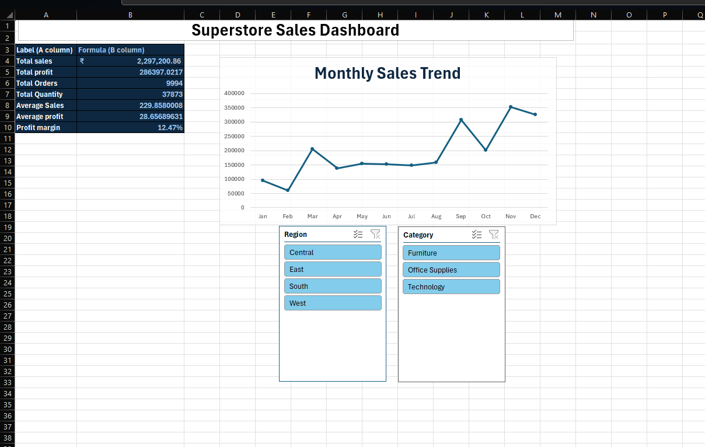

# Superstore Sales Dashboard

## Project Overview
An interactive Sales Dashboard built in Microsoft Excel using Pivot Tables, Charts, and Slicers. Analyzed 10,000+ records from the Superstore dataset.

## Tools Used
- Microsoft Excel
- Pivot Tables
- Line Charts
- Slicers

## Key Insights
- **Total Sales:** ₹22,97,200
- **Total Profit:** ₹2,86,397
- **Profit Margin:** 12.47%
- **Total Orders:** 9,994
- **November** has the highest sales (₹3,52,461)
- **West region** is the most profitable

## Dashboard Preview

## Files
- `Superstore_Sales_Dashboard.xlsx.csv` - Main Excel file
- `Dashboard.png` - Dashboard preview
